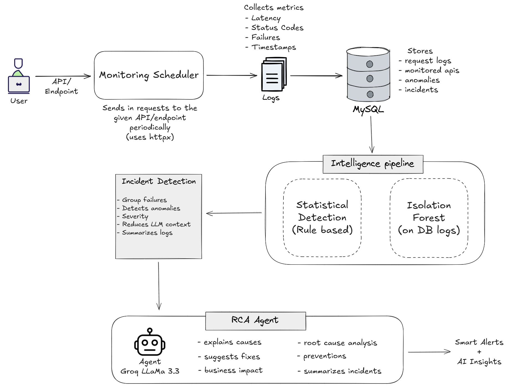

# 🤖 SRE Copilot — AI-Powered API Failure Detection & Debugging Agent

This project was developed for the **[Agentic AI Hackathon](https://unstop.com/hackathons/agentic-ai-hackathon-product-space-1684242)** hosted by **Product Space** on Unstop.

The system focuses on detecting API failures and transforming raw telemetry into intelligent operational insights for both developers and end users.

---

# 📌 1. Project Overview

**SRE Copilot** is a production-grade **AI-powered Site Reliability Engineering (SRE) observability platform** that transforms raw API telemetry into intelligent operational insights — before users ever complain.

Engineering teams today discover API failures only after users start reporting them. Traditional monitoring generates noisy alerts but fails to intelligently correlate issues, explain root causes, or suggest preventive strategies.

SRE Copilot solves this by combining:

- **Continuous API monitoring** with async polling
- **Multi-layer anomaly detection** using ML + statistical methods
- **Intelligent incident grouping** to reduce alert fatigue
- **AI-powered Root Cause Analysis** using a LangChain agent backed by Groq LLaMA 3.3
- **Real-time observability dashboard** inspired by Datadog, Grafana, and New Relic

> *"Build an AI SRE Copilot capable of transforming raw API telemetry into intelligent operational insights before users complain."*


# 🎥 Demo Video

https://github.com/user-attachments/assets/92c5fe59-b6fa-4cc0-a549-22374119d62c

---

# 🌐 Live Links

| | |
|---|---|
| **Frontend** | [sre-copilot.vercel.app](https://sre-copilot.vercel.app) |
| **Backend API** | [sre-copilot-production.up.railway.app](https://sre-copilot-production.up.railway.app) |
| **Dashboard Data** | [/api/dashboard](https://sre-copilot-production.up.railway.app/api/dashboard) |

---

# ⚡ 2. Key Features

✔️ **Live API Monitoring** — continuous async polling at configurable intervals (5s to 30min)

✔️ **Real-time Telemetry Collection** — latency, status codes, failures, timestamps

✔️ **Statistical Anomaly Detection** — Z-score + rolling average + threshold rules

✔️ **Isolation Forest ML Detection** — unsupervised anomaly detection on request logs

✔️ **Incident Correlation Engine** — groups related anomalies, deduplicates alerts, assigns severity

✔️ **LangChain Agent with Tools** — autonomous operational investigation

✔️ **AI Root Cause Analysis** — explains causes, business impact, fixes, prevention strategies

✔️ **Premium Observability Dashboard** — dark-mode, real-time charts, live API health table

✔️ **Production Deployed** — Vercel (frontend) + Railway (backend + MySQL)

---

# 🏗️ 3. System Architecture



The complete platform operates as a multi-stage observability and intelligence pipeline.

High-level flow:

```text
User adds API
        ↓
Monitoring Scheduler polls endpoint
        ↓
Telemetry stored in MySQL
        ↓
Intelligence pipeline analyzes logs
        ↓
Incidents generated
        ↓
AI RCA Agent investigates failures
        ↓
Dashboard displays insights
```

---

# ⚙️ 3.1 Monitoring & Telemetry Architecture

The monitoring subsystem continuously polls user-provided APIs and converts raw operational behavior into structured telemetry.

The monitoring scheduler is built using:

- `AsyncIO`
- `HTTPX`
- Concurrent polling loops

Each monitored API runs independently at configurable intervals:

```text
5s · 10s · 30s · 1min · 5min · 10min · 15min · 30min
```

For every API request, the system collects:

- Request latency
- HTTP status codes
- Success/failure state
- Timestamps
- Connection errors
- Timeout behavior

Example telemetry:

```json
{
  "api_id": 5,
  "status_code": 500,
  "latency_ms": 4201.32,
  "success": false
}
```

The telemetry is stored in:

```sql
request_logs
```

and later consumed by the intelligence pipeline.

---

# 🧠 3.2 Intelligence Pipeline Architecture

The intelligence layer is composed of **three independent detection stages**, each focusing on different operational behavior patterns.

---

## 3.2.1 Rule-Based Detection Layer

This layer detects obvious operational failures using deterministic rules.

Example rules:

```python
if latency > 3000ms:
    → HIGH_LATENCY anomaly

if status_code >= 500:
    → SERVER_ERROR anomaly

if connection fails:
    → CONNECTION_FAILURE anomaly
```

This stage provides immediate anomaly signals with extremely low computational cost.

---

## 3.2.2 Statistical Detection Layer

This layer detects behavioral drift using statistical analysis on recent telemetry.

The system computes:

- Rolling averages
- Standard deviation
- Z-score deviation

Formula:

```text
Z = (observed_value - rolling_mean) / std_deviation
```

If:

```text
Z > threshold
```

the system generates anomalies.

This helps detect:

- gradual latency spikes
- unstable APIs
- fluctuating response behavior
- abnormal operational drift

that static rules may miss.

---

## 3.2.3 Isolation Forest ML Layer

The ML layer uses an unsupervised `Isolation Forest` model to detect unusual operational behavior patterns.

Input features:

```text
latency_ms
status_code
success
```

The model dynamically trains on fresh telemetry stored in MySQL.

Unlike traditional rules, Isolation Forest can detect:

- previously unseen failures
- hidden operational anomalies
- abnormal latency distributions
- unusual API behavior

without requiring labeled training data.

The deployment also includes:

- anomaly deduplication
- cooldown scheduling
- lightweight retraining
- memory optimizations

to make ML-based observability production-safe.

---

# 🚨 3.3 Incident Correlation Engine

Raw anomalies alone create noisy monitoring systems.

To solve this, SRE Copilot introduces an **Incident Correlation Engine**.

Responsibilities:

- Groups related anomalies
- Detects repeated failures
- Assigns severity
- Deduplicates alerts
- Summarizes operational behavior
- Reduces LLM context size

Example:

```text
500 individual request failures
        ↓
1 summarized incident
```

This dramatically improves:

- operational clarity
- alert fatigue reduction
- RCA quality
- token efficiency for the AI agent

Generated incidents are stored in:

```sql
incidents
```

---

# 🤖 3.4 AI RCA Agent Architecture

The RCA subsystem is powered by:

```text
LangChain + Groq LLaMA 3.3 70B
```

The AI agent autonomously gathers operational context using database tools.

Available tools:

- `get_incident_details`
- `get_recent_anomalies`
- `get_incident_history`
- `get_latency_stats`
- `get_recent_request_logs`

The agent performs:

- root cause analysis
- operational debugging
- business impact estimation
- remediation suggestions
- prevention planning

Final RCA output includes:

1. Root Cause Analysis
2. Probable Technical Reasons
3. Business Impact
4. Recommended Fixes
5. Prevention Strategies
6. Severity Assessment

---

# 📡 3.5 End-to-End Operational Flow

The complete production flow is:

```text
User adds API
        ↓
Async Monitoring Scheduler polls endpoint
        ↓
Telemetry stored in MySQL
        ↓
Intelligence Pipeline analyzes logs
        ↓
Anomalies generated
        ↓
Incident Engine groups failures
        ↓
LangChain RCA Agent investigates incidents
        ↓
Dashboard displays AI insights + alerts
```

This architecture enables SRE Copilot to behave like a lightweight autonomous observability engineer rather than a traditional monitoring dashboard.

---

# 🗄️ 4. Database Architecture

The backend database is designed around four core operational entities.

```sql
monitored_apis
```
Stores:
- API endpoint
- HTTP method
- Polling interval
- Monitoring metadata

```sql
request_logs
```
Stores:
- latency
- status codes
- success/failure state
- timestamps

```sql
anomalies
```
Stores:
- anomaly type
- severity
- operational signals
- ML/statistical detections

```sql
incidents
```
Stores:
- grouped failures
- incident summaries
- severity levels
- operational correlation data

---

# 🧠 5. AI Agent Architecture

The RCA Agent is implemented using LangChain’s `create_agent`.

Example tools:

```python
@tool
def get_incident_details(incident_id: int):
    """Fetches incident + API metadata"""

@tool
def get_recent_anomalies(api_id: int):
    """Fetches recent operational anomalies"""

@tool
def get_incident_history(api_id: int):
    """Fetches recurring incident patterns"""

@tool
def get_latency_stats(api_id: int):
    """Computes latency + failure metrics"""

@tool
def get_recent_request_logs(api_id: int) -> list[dict]:
    """Fetches recent request logs for operational debugging context."""
```

The Incident Engine acts as a **context compressor** for the LLM:

```text
Raw request logs
        ↓
Incident grouping
        ↓
Structured operational summary
        ↓
Minimal LLM context
        ↓
High-quality RCA generation
```

This architecture prevents:
- token explosion
- noisy context
- irrelevant telemetry

while improving RCA quality.

---

# 🛠️ 6. Tech Stack

## Frontend

| Technology | Purpose |
|---|---|
| React + Vite | UI framework |
| Tailwind CSS | Styling |
| Recharts | Observability charts |
| Framer Motion | Animations |
| Axios | API communication |

---

## Backend

| Technology | Purpose |
|---|---|
| FastAPI | REST API server |
| AsyncIO | Concurrent monitoring |
| HTTPX | Async API polling |
| MySQL Connector | Database layer |
| python-dotenv | Environment configuration |

---

## AI / ML

| Technology | Purpose |
|---|---|
| LangChain | AI agent framework |
| Groq LLaMA 3.3 70B | LLM inference |
| Scikit-learn | Isolation Forest |
| Pandas + NumPy | Data processing |

---

## Infrastructure

| Technology | Purpose |
|---|---|
| Vercel | Frontend deployment |
| Railway | Backend + MySQL hosting |
| GitHub | CI/CD + auto deployment |

---

# 📁 7. Repository Structure

```
SRE-Copilot/
│
├── client/                                  # React + Vite frontend dashboard
│   │
│   ├── src/
│   │   │
│   │   ├── components/
│   │   │   ├── charts/                      # Recharts telemetry visualizations
│   │   │   │   ├── LatencyChart.jsx         # API latency trend visualization
│   │   │   │   ├── ErrorRateChart.jsx       # Error rate monitoring chart
│   │   │   │   └── IncidentFrequencyChart.jsx # Incident frequency analytics
│   │   │   │
│   │   │   ├── incidents/
│   │   │   │   └── IncidentCard.jsx         # Incident preview UI component
│   │   │   │
│   │   │   ├── layout/
│   │   │   │   ├── Sidebar.jsx              # Main dashboard sidebar
│   │   │   │   ├── Navbar.jsx               # Top navigation bar
│   │   │   │   └── AppLayout.jsx            # Shared dashboard layout wrapper
│   │   │   │
│   │   │   └── ui/                          # Shared reusable UI components
│   │   │       ├── APIStatusBadge.jsx       # API health status indicator
│   │   │       ├── LoadingSpinner.jsx       # Loading state animation
│   │   │       ├── EmptyState.jsx           # Empty/fallback UI state
│   │   │       └── RCABox.jsx               # AI RCA response container
│   │   │
│   │   ├── hooks/
│   │   │   └── useDashboardData.js          # Auto-refresh polling hook
│   │   │
│   │   ├── pages/
│   │   │   ├── Dashboard.jsx                # Main observability overview
│   │   │   ├── AddAPI.jsx                   # API monitoring configuration page
│   │   │   ├── IncidentDetails.jsx          # Detailed incident RCA page
│   │   │   ├── APIDetails.jsx               # Per-API analytics page
│   │   │   ├── Landing.jsx                  # Marketing/landing page
│   │   │   ├── Settings.jsx                 # User/system settings page
│   │   │   └── NotFound.jsx                 # 404 fallback page
│   │   │
│   │   ├── services/
│   │   │   └── api.js                       # Centralized Axios API service
│   │   │
│   │   ├── App.jsx                          # Main React application
│   │   ├── main.jsx
│   │
│   ├── .env                                 # Frontend environment variables
│   ├── .gitignore
│   ├── vercel.json                          # Vercel deployment config
│   ├── vite.config.js
│   └── package.json
│
├── server/                                  # FastAPI backend + intelligence layer
│   ├── agent/
│   │   └── llm_agent.py                     # LangChain AI RCA agent
│   │
│   ├── database/
│   │   ├── db.py                            # MySQL connection manager
│   │   └── schema.sql                       # SQL table definitions
│   │
│   ├── intelligence/
│   │   ├── run_pipeline.py                  # Intelligence pipeline orchestrator
│   │   ├── statistical_detector.py          # Rule-based anomaly detection
│   │   ├── isolation_forest.py              # ML anomaly scoring engine
│   │   └── incident_engine.py               # Incident grouping/correlation engine
│   │
│   ├── scheduler/
│   │   └── monitor.py                       # Async API polling scheduler
│   │
│   ├── logs/                                # Runtime-generated monitoring logs
│   │
│   ├── .env                                 # Backend secrets/API keys
│   ├── .gitignore
│   ├── main.py                              # FastAPI routes + API server
│   ├── Procfile                             # Railway deployment start command
│   ├── requirements.txt                     # Backend dependencies
│   ├── test_detetctor.py                    # Rule based testing script
│   ├── test_if.py                           # ML testing script
│   └── test_incident_engine.py              # Pipeline testing script
│
│                           
├── README.md                                
└── architecture.png                         # System architecture diagram
```

---

# 🚀 8. Local Setup

## Prerequisites

- Python 3.10+
- Node.js 18+
- MySQL 8+

---

## Backend Setup

```bash
cd server
pip install -r requirements.txt
```

Create `.env`:

```env
DB_HOST=localhost
DB_USER=root
DB_PASSWORD=your_password
DB_NAME=api_monitoring
DB_PORT=3306
GROQ_API_KEY=your_groq_api_key
```

Run:

```bash
uvicorn main:app --reload
```

---

## Frontend Setup

```bash
cd client
npm install
```

Create `.env`:

```env
VITE_API_URL=http://127.0.0.1:8000
```

Run:

```bash
npm run dev
```

---

# 🔌 9. API Endpoints

| Method | Endpoint | Description |
|---|---|---|
| `POST` | `/api/monitor` | Start monitoring an API |
| `POST` | `/api/stop/{api_id}` | Stop monitoring |
| `GET` | `/api/dashboard` | Dashboard KPI stats |
| `GET` | `/api/apis` | Live monitored APIs |
| `GET` | `/api/incidents` | All incidents |
| `GET` | `/api/anomalies` | All anomalies |
| `GET` | `/api/rca/{incident_id}` | Generate AI RCA |

---

# 🔮 10. Future Improvements

* **Multi-Browser API Validation** using Playwright/Selenium to test APIs across Chrome, Firefox, Safari, and Edge
* **Multi-Region Monitoring** for detecting region-specific outages, latency spikes, and DNS routing issues
* **Predictive Failure Forecasting** using temporal ML models to predict outages before they occur
* **Slack / PagerDuty / Discord Integrations** for AI-generated operational alerts and incident summaries
* **WebSocket-Based Real-Time Telemetry Streaming** for instant dashboard updates and live anomaly feeds

---

# 📬 Interested in a Similar Project?

I build smart, ML-integrated applications and responsive web platforms. Let’s build something powerful together!

📧 shinjansaha00@gmail.com

🔗 [LinkedIn Profile](https://www.linkedin.com/in/shinjan-saha-1bb744319/)